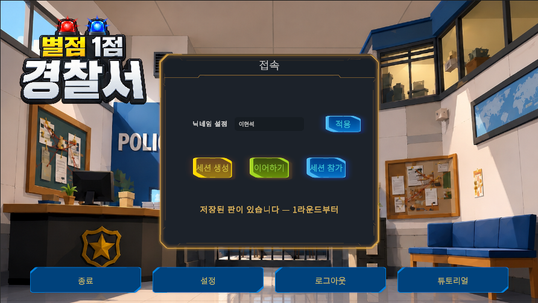
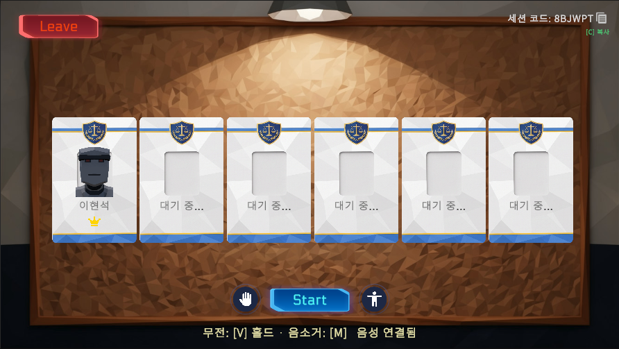
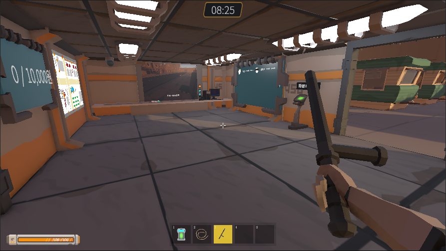
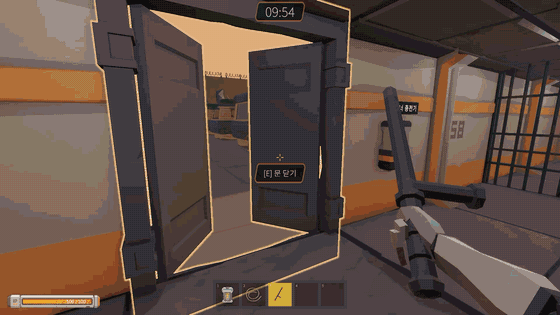
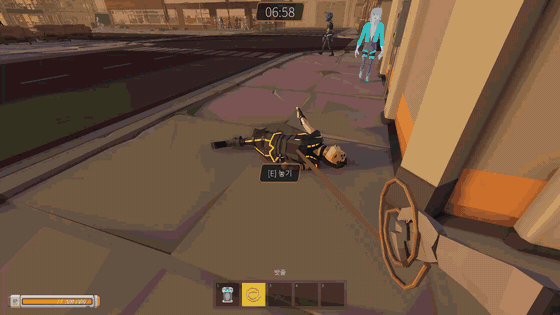
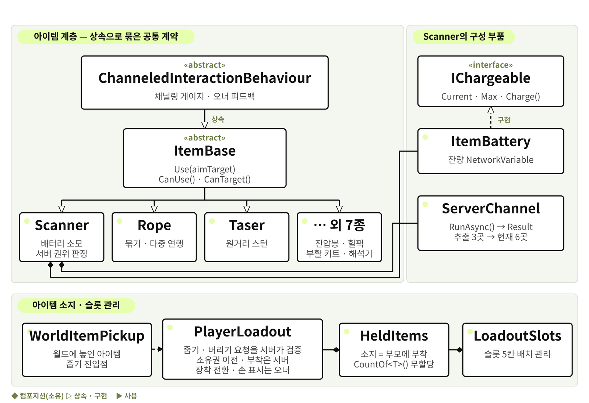

# 별점 1점 경찰서 (One-Star Precinct)

> 치안이 무너진 사이버펑크 세계의 로봇 경찰이 되어, 팀원들과 소통하며 용의자를 검거하는 온라인 협동 수사 게임

`Unity 6000.3 LTS` · `C#` · `Netcode for GameObjects` · `Unity Gaming Services` · `Vivox`

|  |  |  |
| :---: | :---: | :---: |
|  |  |  |
| 타이틀 · 세션 생성 / 참가 | 로비 — 최대 6인 | 본부 — 자금 게시판 · 핫바 |

**4인 팀 프로젝트를 fork한 개인 저장소입니다. 본인(이현석)이 담당한 범위를 중심으로 정리했습니다.**

---

## 게임 소개

- 세션은 `Title → Lobby → Shop → Game → Settlement` 순환. 정산에서 목표 금액을 차감하고 남은 잔액이 다음 라운드 상점 자금이 되며, 바닥나면 게임 오버입니다
- 라운드는 수사 → 제압 → 연행 → 인계 → 판정을 반복합니다. 본부 CCTV와 현장 스캐너로 수배 명단을 대조하고, 제압한 대상을 밧줄로 묶어 유치장까지 끌고 갑니다

|  |  |
| :---: | :---: |
|  |  |
| 현장 — 팀 단위 수색 | 연행 — 밧줄로 묶어 끌기 |

## 조작

| 구분 | 키 |
| --- | --- |
| 이동 · 시점 | `WASD` · 마우스 / `Shift` 달리기 · `Space` 점프 · `Ctrl` 앉기 |
| 아이템 | `좌클릭` 사용 / `1`~`5` · `휠` 슬롯 / `G` 버리기 · `I` 인벤토리 |
| 상호작용 | `E` 줍기 · 문 · 동료 일으키기 / `R` 쓰러진 동료 약탈 |
| 소통 | `V` 무전(홀드) · `M` 음소거 / `T` 감정 표현 · `Tab` 팀 현황 |
| 기타 | `Esc` 일시정지 / `C` 세션 코드 복사 |

## 개발 환경

| 항목 | 내용 |
| --- | --- |
| 엔진 · 언어 | Unity 6000.3 LTS (URP) · C# |
| 멀티플레이 | Netcode for GameObjects, Unity Gaming Services (Relay · Lobby), Vivox |
| 기간 · 인원 | 2026.07.08 – 09.03 · 4명 |

## 프로젝트 구조

```
Assets/Scripts/
├── Core/          App 파사드 · 매니저 베이스 · 커서 잠금
├── Network/       세션 · Relay 접속 · 씬 동기화
├── Round/         라운드 진행 · 정산
├── Player/        이동 · 시점 · 소지품 · 약탈
├── Item/          아이템 계층 (Core · Tools · Weapons · Power · Jail)
├── Interaction/   상호작용 · 검거 · 연행
├── NPC/           시민 · 용의자 FSM
├── HQ/            본부 — CCTV · 수배 명단 · 유치장 · 미니맵
├── Economy/       팀 자금 · 상점 · 본부 택배
├── Events/        돌발 이벤트 (정전 · 탈옥 · 납치 등)
├── Tutorial/      튜토리얼 진행
├── UI/            HUD · 패널
└── Editor/        맵 · 메시 · 아이콘 에디터 툴
```

전역 매니저 접근은 `App` 파사드 한 경로로 통일했고, 베이스 클래스를 상속하면 리플렉션으로 자동 등록됩니다.

## 담당 범위

| 담당 영역 | 주요 작업 | 담당 형태 |
| --- | --- | --- |
| 아이템 · 인벤토리 | ItemBase · IChargeable 계약 설계, 아이템 10종 확장, 줍기 · 버리기 서버 검증, ServerChannel 공통화 | 설계 · 구현 전담 |
| 검거 · 연행 | 밧줄 연행 시스템 — 연결 동기화, 무게 페널티 · 장력 반경, 다중 연행 배치 | 설계 · 구현 전담 |
| 팀 경제 루프 | 팀 공용 자금 · 구매품 이월 · 맵 선택 홀더, 라운드 정산 데이터, 상점 · Shop 씬 | 설계 · 구현 (일부 협업) |
| 에디터 툴 | MapGridBuilder · MeshSlicer · FacadeRunner · FPArmGenerator · ItemIconBaker, 맵 2종 제작 | 단독 작성 |
| 튜토리얼 · UI | TutorialDirector, 인벤토리 핫바 · 스캔 HUD · ESC 패널, 커서 잠금 단일화 | 단독 작성 |
| 성능 계측 · 트러블슈팅 | CSV 성능 계측기 제작, 담당 시스템 실측, 이슈 단위 버그 대응 | 단독 작성 |

전담은 설계부터 구현까지 진행한 항목, 일부 협업은 팀원과 나눠 작업한 구간이 있는 항목입니다. 모든 작업은 이슈 → 브랜치 → PR → 리뷰 승인 → 머지로 진행했습니다.

---

## 담당 시스템

### 1. 아이템 · 인벤토리 아키텍처

- **문제** — 아이템마다 사용 로직이 제각각이라, 새 아이템 하나를 추가할 때마다 플레이어 코드를 수정해야 했습니다
- **계약 고정** — `ItemBase`가 표시 데이터와 사용 진입점 `Use(GameObject aimTarget)`을 계약으로 고정
- **충전 분리** — 상속이 아니라 `IChargeable` 인터페이스로 분리. 성격이 다른 기능을 상속 계층에 섞지 않기 위해서입니다
- **조준 주체** — 아이템이 스스로 레이캐스트하지 않고 `PlayerInteractor`가 대상을 넘깁니다. 조준 규칙이 바뀌어도 아이템 코드는 그대로입니다
- **재설계** — 버리기 · 줍기가 생기며 아이템을 독립 `NetworkObject`로 전환. 소지 = 부모 부착이라 NGO가 복제해 주고, 별도 소지 목록이 실제 부착과 어긋날 여지가 없습니다
- **결과** — 아이템 10종 확장, 이후 팀원이 추가한 아이템도 `ItemBase` 상속만으로 동작. 반복되던 CTS 소유 · 재진입 가드를 `ServerChannel`로 추출해 사용처가 3곳 → 6곳



### 2. 밧줄 연행 시스템

- **문제** — 수갑 검거는 회수 규칙이 복잡했고 협동이 발생하지 않아, 기본 검거 수단을 밧줄로 이관하도록 GDD를 개정했습니다
- **연결 단위 상태** — `RopeTether`를 `PlayerEscorter`의 `NetworkList`로 동기화. 여러 명이 같은 대상을 묶을 수 있어 NPC의 `IsRoped`만으로는 '누가' 끄는지 알 수 없기 때문입니다
- **장력 반경 = 끊김 거리 ÷ 참가자 수** — 합력으로 NPC가 참가자들의 중점에 오므로 각자의 거리가 전체의 1/n. 각자 자기 반경만 지키면 상대 위치를 몰라도 성립합니다
- **다중 연행 배치** — 자리 번호를 매겨 밧줄 방향에 수직으로 부채꼴 배치. 배치하지 않으면 전원이 한 점에 앵커돼 서로 통과합니다
- **트러블슈팅** — 원격에서 '끌고 있음' 표시가 첫 값에 고정. `RopeTether.Equals`가 `NpcId`만 비교해 `NetworkList.Set`이 변경을 삼킨 것이 원인이었고, 동기화 구조체의 `Equals`는 전 필드를 비교한다는 원칙으로 고정했습니다

### 3. 팀 경제 루프

- **문제** — 검거 보상이 개인 단위로 쌓여 협동할 이유가 없었고, 라운드가 끝나면 상태가 씬과 함께 죽어 이월 개념이 없었습니다
- **`TeamFund`** — 세션 시작 시 1회 스폰(`destroyWithScene: false`). 가산은 정산 1회, 차감은 상점 구매(`TrySpend`)뿐으로 못박고 서버 권위 `NetworkVariable<int>`로 동기화
- **`SettlementData`** — 라운드 종료 시점의 스냅샷. 정산 화면 표시 중에도 상태가 계속 움직여 표시가 흔들리는 것을 막기 위해서입니다
- **`ShopPurchases`** — 구매품을 팀 소유 목록에 기록하고 게임 씬 진입 시 본부 택배로 재지급. 씬을 넘기는 오브젝트를 늘리는 대신 이월을 데이터로 처리했습니다
- **App 파사드 등록** — 셋 다 씬을 넘어 살아 인스펙터 배선이 불가능합니다. 팀 등록 기준에 정확히 맞지 않아 예외 사유를 아키텍처 문서에 기재하고 합의로 남겼습니다

### 4. 에디터 툴 파이프라인

- **문제** — 격자 바닥 · 경계벽 배치가 맵 하나당 수백 개였고 맵마다 반복됐습니다. 이 항목의 도구는 전부 단독 작성했습니다
- **MapGridBuilder** — ASCII 레이아웃 한 장 + `MapPalette`로 바닥 · 경계벽 생성. 건물은 풋프린트와 회전이 제각각이라 자동화에서 의도적으로 제외했고, 새 테마는 팔레트만 추가하면 됩니다
- **MeshSlicer** — Sutherland–Hodgman 클리핑 직접 구현. 절단면을 가로지르는 삼각형을 잘라 새 정점을 만들고 UV · 노멀 · 탱젠트를 보간합니다. 벽 격자가 2.5m라 정점선 사이를 지나는 삼각형이 반드시 생기기 때문입니다
- **FacadeRunner** — 두 점을 잇는 선을 따라 건물 파사드를 랜덤 적층. 조각 팔레트는 이름 규칙으로 자동 수집
- **FPArmGenerator · ItemIconBaker** — 1인칭 팔 리그 생성, 인벤토리 아이콘을 아이템 모델에서 직접 렌더
- **결과** — 맵 2종 제작, 절차를 문서화해 다른 팀원도 맵을 추가할 수 있게 했습니다

### 5. 튜토리얼 · UI

- **TutorialDirector** (416줄, 단독) — 로컬 호스트를 띄우고 안내 문구를 단계별 교체
- **폴링 판정** — 조건 열 가지를 위해 시스템 열 곳에 이벤트를 뚫는 대신, 기존 이벤트만 구독하고 나머지는 매 프레임 조회. 한 번에 도는 조건이 하나뿐이라 비용이 없고 게임 코드를 건드리지 않습니다
- **인게임 UI** — 인벤토리 핫바, 스캐너 배터리 · 스캔 상태, 상호작용 라벨, ESC 일시정지 패널(`EscMenuGuard`)
- **커서 잠금** — 카운터 기반 단일 경로로 통일. 여러 UI가 각자 잠금을 걸고 풀며 서로를 덮어쓰던 문제를 구조로 차단

### 6. 성능 계측

- **문제** — 빌드의 Profiler는 에디터로 스트리밍될 뿐 파일로 남지 않고, 캡처를 저장해도 `.raw` 바이너리라 수치화가 어렵습니다
- **계측기 제작** — `ProfilerRecorder` · `ProfilerMarker`로 매 프레임 읽어 CSV 기록. `RuntimeInitializeOnLoadMethod`로 자체 생성해 씬 diff가 없고, `DEVELOPMENT_BUILD` 조건부 컴파일로 릴리스에서 제외됩니다
- **구간 분리** — 상황이 다른 데이터가 섞여 평균이 왜곡되지 않도록 Phase 단위로 기록
- **결과** — 개발 빌드 12,557프레임 / 135초 실측. `RopeDragLoad.ServerTickWeight`는 평균 0.0017ms · p95 0.0025ms로 60fps 예산의 0.01%. 같은 측정에서 라운드 시작 구간의 1.56초 스톨과 GC 38MB를 발견해 팀에 공유했습니다

---

## 트러블슈팅

| 증상 | 원인 | 조치 |
| --- | --- | --- |
| 아이템 드롭 위치가 클라이언트마다 어긋남 | 위치를 각 클라이언트가 결정 | 결정 주체를 서버로 통일 |
| 버려진 아이템을 밟으면 캐릭터가 떠오름 | 줍기 콜라이더가 물리 충돌체로 동작 | 트리거로 전환 |
| 재세션 시 `TeamFund` 미스폰 | 세션 종료 후에도 스폰 플래그가 남음 | 종료 시점에 플래그 리셋 |
| 스캐너를 버리면 다시 줍지 못함 | 가시선 끝점 전제가 틀림 | 끝점 판정 수정 |

## 플레이 영상

<!-- YouTube 링크 -->

_준비 중_
