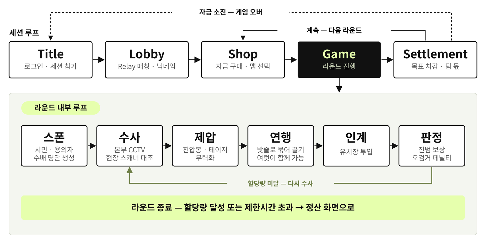

# 별점 1점 경찰서 (One-Star Precinct)

> 치안이 무너진 사이버펑크 세계의 로봇 경찰이 되어, 팀원들과 소통하며 용의자를 검거하는 온라인 협동 수사 게임

`Unity 6000.3 LTS` · `C#` · `Netcode for GameObjects` · `Unity Gaming Services` · `Vivox`

|  |  |  |
| :---: | :---: | :---: |
|  |  |  |
| 타이틀 · 세션 생성 / 참가 | 로비 — 최대 6인 | 본부 — 자금 게시판 · 핫바 |

**이 저장소는 4인 팀 프로젝트를 fork한 개인 저장소입니다. 아래 내용은 본인(이현석)이 담당한 범위를 중심으로 정리했습니다.**

---

## 게임 소개

세션은 `Title → Lobby → Shop → Game → Settlement`로 이어집니다. 정산에서 목표 금액을 차감하고 남은 잔액이 다음 라운드의 상점 자금이 되며, 자금이 바닥나면 게임 오버입니다.

라운드 안에서는 수사 → 제압 → 연행 → 인계 → 판정을 반복합니다. 본부 CCTV와 현장 스캐너로 수배 명단을 대조하고, 제압한 대상을 밧줄로 묶어 유치장까지 끌고 갑니다. 진범이면 보상을, 오검거면 페널티를 받습니다.



## 조작

| 구분 | 키 | 동작 |
| --- | --- | --- |
| 이동 · 시점 | `W` `A` `S` `D` / 마우스 | 이동 / 시점 회전 |
|  | `Shift` · `Space` · `Ctrl` | 달리기 · 점프 · 앉기 |
| 아이템 | `마우스 좌클릭` | 손에 든 아이템 사용 |
|  | `1` ~ `5` · `마우스 휠` | 슬롯 선택 · 이전 / 다음 슬롯 |
|  | `G` · `I` | 버리기 · 인벤토리 |
| 상호작용 | `E` | 줍기 · 문 · 콘솔 · 쓰러진 동료 일으키기 |
|  | `R` | 쓰러진 동료의 소지품 약탈 |
| 소통 | `V` (홀드) · `M` | 무전 · 마이크 음소거 |
|  | `T` · `Tab` | 감정 표현 · 팀 현황 |
| 기타 | `Esc` · `C` | 일시정지 · 세션 코드 복사(로비) |

무전 `V`가 홀드 방식인 것은, 본부와 현장이 떨어진 채로 정보를 주고받는 것이 이 게임의 핵심이기 때문입니다.

## 개발 환경

| 항목 | 내용 |
| --- | --- |
| 엔진 | Unity 6000.3 LTS (URP) |
| 언어 | C# |
| 멀티플레이 | Netcode for GameObjects, Unity Gaming Services (Relay · Lobby) |
| 음성 | Vivox |
| 개발 기간 | 2026.07.08 – 09.03 |
| 개발 인원 | 4명 |

## 담당 범위

| 담당 영역 | 주요 작업 | 담당 형태 |
| --- | --- | --- |
| 아이템 · 인벤토리 | ItemBase · IChargeable 계약 설계, 아이템 10종 확장, 줍기 · 버리기 서버 검증, ServerChannel 공통화 | 설계 · 구현 전담 |
| 검거 · 연행 | 밧줄 연행 시스템 — 연결 동기화, 무게 페널티 · 장력 반경, 다중 연행 배치 | 설계 · 구현 전담 |
| 팀 경제 루프 | 팀 공용 자금 · 구매품 이월 · 맵 선택 홀더, 라운드 정산 데이터, 상점 · Shop 씬 | 설계 · 구현 (일부 협업) |
| 에디터 툴 | MapGridBuilder · MeshSlicer · FacadeRunner · FPArmGenerator · ItemIconBaker, 맵 2종 제작 | 단독 작성 |
| 튜토리얼 · UI | TutorialDirector, 인벤토리 핫바 · 스캔 HUD · ESC 패널, 커서 잠금 단일화 | 단독 작성 |
| 성능 계측 · 트러블슈팅 | CSV 성능 계측기 제작, 담당 시스템 실측, 이슈 단위 버그 대응 | 단독 작성 |

전담은 설계부터 구현까지 본인이 진행한 항목이고, 일부 협업은 팀원과 나눠 작업한 구간이 있는 항목입니다. 모든 작업은 이슈 → 브랜치 → PR → 리뷰 승인 → 머지 순서로 진행했습니다.

---

## 담당 시스템

### 1. 아이템 · 인벤토리 아키텍처

**문제** — 초기에는 아이템마다 사용 로직이 제각각이라, 새 아이템 하나를 추가할 때마다 플레이어 코드를 건드려야 했습니다. 아이템 종류는 계속 늘어날 예정이었고 충전 · 조준 · 채널링처럼 성격도 서로 달랐습니다.

**설계** — `ItemBase` 추상 클래스가 표시 데이터와 사용 진입점 `Use(GameObject aimTarget)`를 계약으로 고정합니다. 충전은 상속이 아니라 `IChargeable` 인터페이스로 분리해, 충전이 필요한 아이템만 구현하도록 했습니다.

조준 대상을 파라미터로 넘긴 이유는, 아이템이 스스로 레이캐스트를 쏘지 않게 해서 조준 로직을 `PlayerInteractor` 한 곳에 모으기 위해서입니다. 덕분에 조준 규칙이 바뀌어도 아이템 코드는 건드리지 않습니다.

**재설계** — 버리기 · 줍기가 생기면서 '아이템은 플레이어 안의 데이터'라는 전제가 깨졌습니다. 아이템을 독립 `NetworkObject`로 바꾸고 소지를 부모 부착으로 표현했습니다. 부착은 NGO가 복제하므로 서버와 오너가 언제나 같은 답을 냅니다. 별도 소지 목록을 두지 않은 것은, 목록과 실제 부착이 어긋나는 버그를 구조적으로 막기 위해서였습니다.

**결과** — 같은 계약 위에 아이템 10종이 얹혔고, 이후 팀원이 추가한 아이템도 `ItemBase` 상속만으로 동작했습니다. 스캐너 · 연행 · 부활 세 곳에서 반복되던 CTS 소유 · 재진입 가드 · 정리 골격은 `ServerChannel`로 추출했고, 사용처가 3곳에서 6곳으로 늘었습니다.


### 2. 밧줄 연행 시스템

**문제** — 수갑 검거는 소모품이라 회수 규칙이 복잡했고, 연행 과정에서 협동이 발생하지 않았습니다. 기본 검거 수단을 밧줄로 이관해 '여럿이 함께 끄는' 상황을 만들기로 GDD를 개정했습니다. 동시에 몇 명을 끌 수 있는지를 소지한 밧줄 개수로 제한해, 자원 배분이 선택의 문제가 되도록 했습니다.

**설계** — 끌기 상태를 NPC가 아니라 **연결마다** 두었습니다. `RopeTether` 구조체를 `PlayerEscorter`의 `NetworkList`로 전 피어에 동기화합니다. 여러 명이 같은 대상을 묶을 수 있어서, NPC의 `IsRoped`는 '누구든 끌고 있다'까지만 알려 줍니다. 내가 놓았는데 남이 계속 끌고 있는 상태를 구분하려면 참가자별 플래그가 필요했습니다. 진실은 NPC의 앵커 목록이고, `NetworkList`는 표시 · 검증용입니다.

**장력** — 장력 반경 = 끊김 거리 ÷ 참가자 수입니다. 합력으로 NPC가 참가자들의 중점에 오기 때문에, 각자의 거리가 곧 전체의 1/n이 됩니다. 각자 자기 반경만 지키면 합이 끊김 거리로 묶이므로, 상대 위치를 몰라도 성립합니다. 여럿이 끌 때는 자리 번호를 매겨 밧줄 방향에 수직으로 부채꼴 배치를 했습니다. 배치하지 않으면 전원이 한 점에 앵커돼 서로 통과하며 한 덩어리가 됩니다.

무게와 장력은 `PlayerMovement`만 소비하므로 `RopeDragLoad`로 분리했습니다. 연결 목록은 표시 · 검증 · 인계가 읽고, 이 두 값은 이동만 읽습니다.

**트러블슈팅** — 원격 클라이언트에서 '끌고 있음' 표시가 처음 값에 굳어 반전되지 않는 문제가 있었습니다. 원인은 `RopeTether.Equals`가 `NpcId`만 비교한 것이었습니다. `NetworkList.Set`은 `AreEqual`로 갱신 여부를 판단하는데, 같다고 나오면 내부 리스트에 쓰지도 복제하지도 않아 `Dragging` 반전이 통째로 삼켜졌습니다. 동기화 대상 구조체의 `Equals`는 모든 필드를 비교해야 한다는 원칙을 세우고, 근거를 주석으로 고정했습니다.

### 3. 팀 경제 루프

**문제** — 협동 게임인데 검거 보상이 개인 단위로 쌓여 '같이 끌어야 할 이유'가 없었습니다. 라운드가 끝나면 상태가 씬과 함께 죽어 이월이라는 개념 자체가 없었습니다. 자금 · 정산 · 상점 셋을 한 흐름으로 설계해야 했습니다.

- **`TeamFund`** — 서버가 세션 시작 시 1회 스폰(`destroyWithScene: false`)해 씬 전환에도 살아남습니다. 가산은 라운드 종료 정산 1회, 차감은 상점 구매(`TrySpend`)뿐으로 못박아 자금이 어긋날 여지를 없앴습니다. 서버 권위 `NetworkVariable<int>`로 전 피어에 잔액을 동기화합니다.
- **`SettlementData`** — 라운드 종료 시점의 스냅샷을 뜹니다. 결과 · 종료 사유 · 잔액 · 증감 · 총수익 · 목표 금액 · 진범 수를 한 번에 전달합니다. 정산 화면이 뜬 뒤에도 상태가 계속 움직이면 표시가 흔들리기 때문에 스냅샷으로 고정했습니다.
- **`ShopPurchases`** — 구매품을 구매자 인벤토리로 직행시키지 않고 팀 소유 목록에 기록합니다. 게임 씬 진입 시 `ShopDelivery`가 목록을 훑어 본부 택배 지점에서 다시 지급합니다. 씬을 넘기는 오브젝트를 늘리는 대신 이월을 데이터로 처리했습니다.

이 셋은 씬을 넘어 살기 때문에 인스펙터 배선이 불가능합니다. 그래서 팀 아키텍처의 `App` 파사드가 유일한 접근 경로가 되는데, 팀이 정한 등록 기준에 정확히 맞지는 않아 예외 사유를 아키텍처 문서에 기재하고 팀 합의로 남겼습니다.

### 4. 에디터 툴 파이프라인

**문제** — 격자 단위 바닥 · 경계벽 배치가 맵 하나당 수백 개였고, 맵을 추가할 때마다 처음부터 반복됐습니다. 에셋 건물 중에는 통짜 메시가 있어 벽 한 조각만 떼어 모듈 벽으로 쓸 수 없었습니다. 이 항목의 도구는 전부 단독으로 작성했습니다.

- **MapGridBuilder** — ASCII 레이아웃 텍스트 한 장과 `MapPalette` ScriptableObject를 입력으로 받아 바닥과 경계벽을 격자로 생성합니다. 건물 · 프롭은 일부러 제외했습니다. 풋프린트와 회전이 제각각이라 ASCII로 표현하면 오히려 손이 더 간다고 판단했습니다. 새 테마는 팔레트만 하나 더 만들면 되고 스크립트는 고치지 않습니다. 레이아웃 첫 줄이 북쪽(z 최대)이라 에디터에서 내려다본 모양 그대로 읽힙니다.
- **MeshSlicer** — Sutherland–Hodgman 다각형 클리핑을 직접 구현했습니다. 상자 안에 완전히 든 삼각형만 고르는 방식이 아니라, 절단면을 가로지르는 삼각형을 잘라 새 정점을 만들고 UV · 노멀 · 탱젠트 · 컬러를 원본에서 보간합니다. 본부 벽 격자가 2.5m라 정점선 사이를 지나는 삼각형이 반드시 생기기 때문에 진짜 클리핑이 필요했습니다.
- **FacadeRunner** — 두 점을 잇는 선을 따라 건물 파사드를 랜덤으로 적층합니다. 조각 팔레트는 이름 규칙으로 자동 수집해 프리팹 목록을 손으로 관리하지 않습니다.
- **FPArmGenerator / ItemIconBaker** — 1인칭 팔 뷰모델 리그를 생성하고, 인벤토리 아이콘을 아이템 모델에서 직접 굽습니다. 아이콘을 손으로 그리면 실제로 손에 들리는 물건과 어긋날 수 있어 모델을 소스로 삼았습니다.

이 도구들로 맵 2종을 제작하고, 절차를 문서로 남겨 다른 팀원도 맵을 추가할 수 있게 했습니다.

### 5. 튜토리얼 · UI

**TutorialDirector** (416줄, 단독 작성) — 로컬 호스트를 띄우고 안내 문구를 단계별로 교체합니다. 단계 판정은 폴링으로 처리했습니다. 열 가지 조건을 위해 시스템 열 곳에 이벤트를 새로 뚫는 대신, 이미 있는 이벤트만 구독해 깃발을 세우고 나머지는 매 프레임 상태를 읽습니다. 한 번에 도는 조건이 하나뿐이라 비용이 사실상 없고, 기존 시스템에 손을 대지 않았기 때문에 튜토리얼 때문에 게임 코드가 오염되지 않았습니다.

**인게임 UI** — 인벤토리 핫바(슬롯 구성 변경 이벤트 구독), 스캐너 배터리 · 스캔 상태 표시, 상호작용 오브젝트 식별 라벨, ESC 일시정지 패널(`EscMenuGuard`)을 작업했습니다.

커서 잠금 소유권은 카운터 기반 단일 경로로 통일했습니다. 여러 UI가 각자 잠금을 걸고 풀며 서로의 상태를 덮어쓰던 문제를 구조로 막았습니다.

### 6. 성능 계측

**문제** — 빌드에 붙인 Profiler는 에디터로 스트리밍될 뿐 파일로 남지 않고, 캡처를 저장해도 `.raw` 바이너리라 수치를 표나 그래프로 옮기기 어렵습니다.

**해결** — `ProfilerRecorder`와 `ProfilerMarker`로 매 프레임 직접 읽어 CSV로 기록하는 계측기를 만들었습니다. `RuntimeInitializeOnLoadMethod`로 스스로 생성하기 때문에 씬 파일 diff를 만들지 않아 팀원 작업과 충돌하지 않고, `DEVELOPMENT_BUILD` 조건부 컴파일로 릴리스 빌드에서는 아예 빠집니다. 상황이 다른 데이터가 한 파일에 섞이면 평균이 의미를 잃기 때문에 구간(Phase)을 분리해 기록합니다.

**결과** — WindowsPlayer 개발 빌드에서 12,557프레임 / 135초를 측정했습니다. 매 프레임 도는 `RopeDragLoad.ServerTickWeight`는 8,594프레임 실행에 평균 0.0017ms, p95 0.0025ms로 60fps 프레임 예산 16.7ms의 0.01%였습니다. 최적화가 필요 없다는 것을 측정으로 확인한 셈입니다. 같은 측정에서 라운드 시작 구간의 1.56초 스톨과 GC 38MB를 발견해 팀에 공유했습니다.

---

## 트러블슈팅

| 증상 | 원인 | 조치 |
| --- | --- | --- |
| 아이템 드롭 위치가 클라이언트마다 어긋남 | 위치를 각 클라이언트가 결정 | 결정 주체를 서버로 통일 |
| 버려진 아이템을 밟으면 캐릭터가 떠오름 | 줍기 콜라이더가 물리 충돌체로 동작 | 트리거로 전환 |
| 재세션 시 `TeamFund` 미스폰 | 세션 종료 후에도 스폰 플래그가 남음 | 종료 시점에 플래그 리셋 |
| 스캐너를 버리면 다시 줍지 못함 | 가시선 끝점 전제가 틀림 | 끝점 판정 수정 |

---

## 프로젝트 구조

```
Assets/Scripts/
├── Core/          App 파사드 · 매니저 베이스 · 커서 잠금
├── Network/       세션 · Relay 접속 · 씬 동기화
├── Round/         라운드 진행 · 정산
├── Player/        이동 · 시점 · 소지품 · 약탈
├── Item/          아이템 계층 (Core · Tools · Weapons · Power · Jail)
├── Interaction/   상호작용 · 검거 · 연행
├── NPC/           시민 · 용의자 FSM
├── HQ/            본부 — CCTV · 수배 명단 · 유치장 · 미니맵
├── Economy/       팀 자금 · 상점 · 본부 택배
├── Events/        돌발 이벤트 (정전 · 탈옥 · 납치 등)
├── Tutorial/      튜토리얼 진행
├── UI/            HUD · 패널
└── Editor/        맵 · 메시 · 아이콘 에디터 툴
docs/              설계 문서 · 다이어그램 · 스크린샷
```

전역 매니저 접근은 `App` 파사드 한 경로로만 하고, 매니저는 베이스 클래스를 상속하면 리플렉션으로 자동 등록됩니다. 팀이 합의한 규칙이며 PR 리뷰 기준으로 운용했습니다.

## 플레이 영상

<!-- YouTube 링크 -->

_준비 중_
